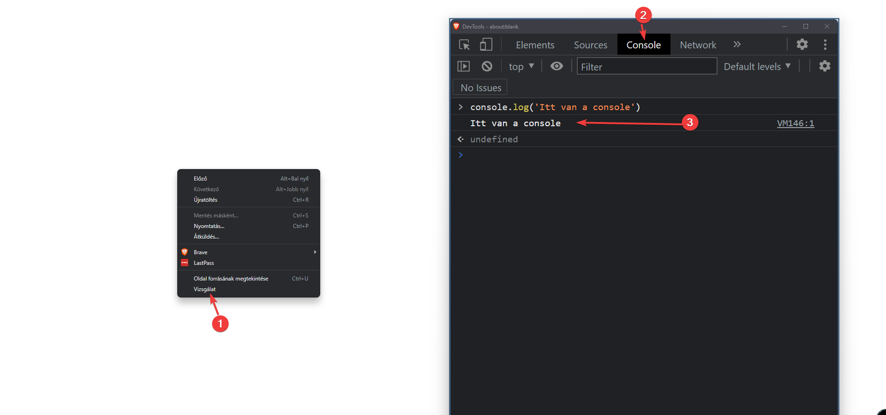

# Alert, log és prompt függvények

## Alert

A programunknak kommunikálnia kell a felhasználóval, ezt legegyszerűbb módon az `alert('információ')` függvénnyel tehetjük. Pl.:

```js
alert("Hey is this thing on?");
```


> :warning: Az alert úgynevezett **blokkoló** művelet, vagyis a kód nem fut tovább amíg a felhasználó nem csukja be az ablakot.

## Log

Gyakran szoktunk hibás kódot írni, ilyenkor segíthet egy kis kiírás mely jelzi, hogy kódunk eljutott egy bizonyos pontra, illetve, hogy egy változó milyen értéket vett fel az adott ponton.

```js
console.log("Hogy ityeg a fityeg?");
console.log({}, []); //Bonyolultabb objektumokat is hibamenetesen ki tud írni
console.log("%cKék %cPiros ", "color:blue;", "color:red"); // Akár css-t is használhatunk a színezéshez a %c paraméter segítségével
```


> :heavy_check_mark: A log **nem blokkoló** művelet, így a kód nem vár felhasználói interakcióra

> :warning: Ez az üzenet a konzolba kerül, ideális helyre fejlesztőknek, de nem felhasználóknak

<details>
<summary>Hol a console kimenete?</summary>


A html-es debug ablakban

</details>
<br/>

## Prompt

A programunk sokszor kérhet a felhasználtól információt valamilyen formában, ekkor alkalmazzuk a `prompt('kérdés?')` függvényt, ami egy felugró ablakban bekér információt, pl.:

```js
prompt("Mi az ábra fiatalok?");
```


Ez így önmagában nem túl hasznos, érdemes eltárolni egy [változóban](valtozo.md) majd kiírni.

```js
const abra = prompt("Mi az ábra fiatalok?");
alert(abra);
```

Mit figyeltünk meg?
Amit beírt a felhasználó az egy másik felugró ablakban megnyílt.
<br/><br/>

Illetve a prompt-nak egy alapértéket is megadhatunk, amennyiben a felhasználó nem ír be semmit:

```js
const abra = prompt("Mi az ábra fiatalok?", "Minden rendben");
alert(abra); // Minden rendben, abban az esetben ha a felhasználó nem ír be semmit
```
