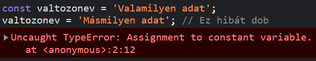

# Változók

A változók segítségével el tudunk tárolni bármilyen információt, amelyet majd később máshol a kódban fel tudunk használni.

## Let

A let **kulcsszó** segítségével tudunk változót létrehozni (változó nagyjából név bármi lehet, de javasolt a számok és ékezetes betűk kerülése). Majd jobb oldalt egy egyenlőségjel után tudjuk megadni, hogy mit tároljon ez a változó.

```js
let valtozonev = "Valamilyen adat"; // Egyszöveget eltároltunk egy valtozonev nevű változóban
// Más egyéb kód
console.log(valtozonev); // 'Valamilyen adat'-ot később is elérhetjűk a nevére hivatkozva
```

A változók értékét lehet menetközben változtani.

```js
let valtozonev = "Valamilyen adat"; // Most szöveg
valtozonev = 0; // Most szám

console.log(valtozonev); // 0, mivel megváltoztattuk
```

> :warning: Amikor egy létező változót írunk át **NEM** kell a let, mivel azzal csak létrehozzunk.

Felhasználói bemenet tárolása, lásd [prompt](alert_log_prompt.md#prompt)

## Const

Konstans mint a matekban, érték adás után nem lehet megváltoztatni, értéke állandó.
Let-hez hasonló módon kell használni:

```js
const valtozonev = "Valamilyen adat";
valtozonev = "Másmilyen adat"; // Ez hibát dob
```



## Scopeok

A változók scopeoltak, vagyis bizonyos kód reszeken belül érhetőek csak el. Tehát ha használunk egy while loopon belül egy változót, akkor azt már azon kívűl nem érhetjük el.
Pl.:

```js
let i = 0;
while (i < 10) {
  let osztvaKettovel = i / 2;
  console.log(osztvaKettovel); // Tökéletesen működik
  i++;
}
console.log(i); // Elérhető mivel while-on kívül van
console.log(osztvaKettovel); // Hibát fog dobni
```
