# Első használat

## Git letöltése és telepítése (windows-ra)

A gitet a [https://git-scm.com/downloads](https://git-scm.com/downloads) címről lehet letölteni.
A monitorban megjelenő gomb fog minket a megfelelő oldralra vinni, amenyiben nem, akkor a mellette található négyzetben van a többi lehetőség.

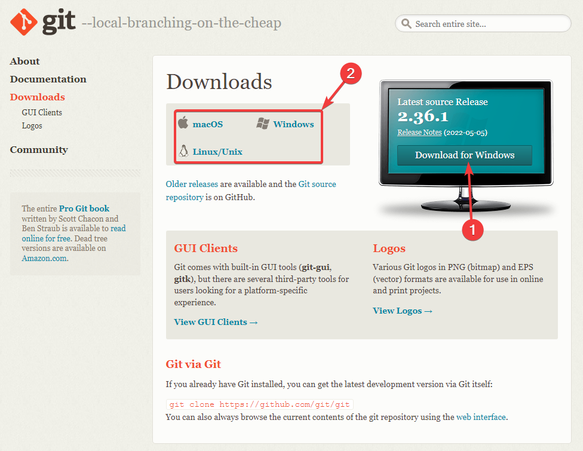

A standalone installer fájlra van szükségünk:

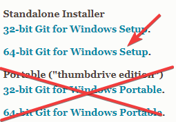


A telepítő megnyitásakor el kell fogadnunk a szerződési feltételeket, illetve meg kell adni a telepítés helyét. **FONTOS**: Ezekhez ne nyúljunk hozzá csak lépjünk tovább

Győződjünk meg róla, hogy ez a három opció be van a pipálva:
- A frissítések keresése ajánlott, de nem kötelező
- Illetve **win11** felhasználóknak ajánlott a Bash profile Terminálhoz adása


A telepítő még megkérdezi a shorcut nevét, ezt hagyjuk Git-en

Következő lépésben adjuk meg, hogy a vsc az alapértelmezett szerkesztő.
> :warning: Figyeljünk, hogy **NE** az insider verziót adjuk meg

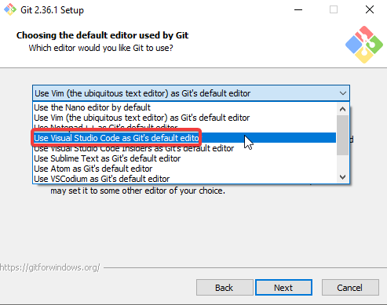

Ajánlott a GitHub szabvány `main`-re átállítani az alapértelmezett branch nevet.

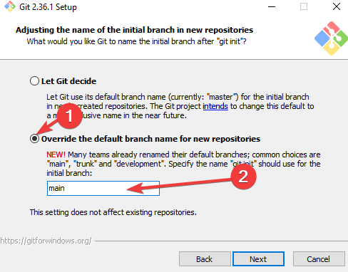

A következő lépésben a környezeti változókról (PATH-ról) van szó ezt hagyjuk az alap `Git from cmd line and also from 3rd party` értéken

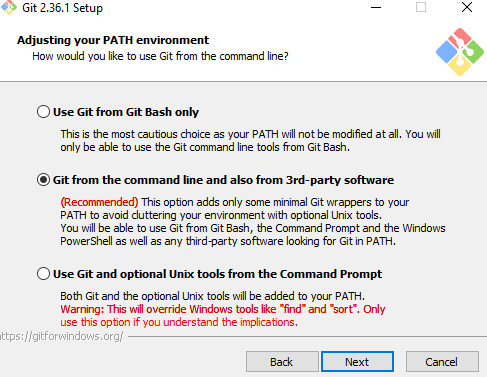

Aztán az ssh könyvtárat is hagyjuk az alap `bundled` beállításon

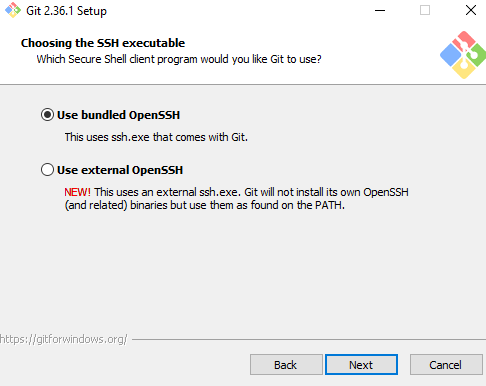

HTTPs könyvtárat is hagyjuk az alap `OpenSSl` beállításon

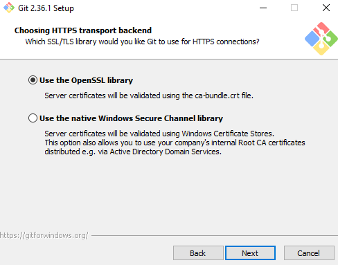

A line checkout style is maradhat az alap `checkout Windows, commit Unix`-on

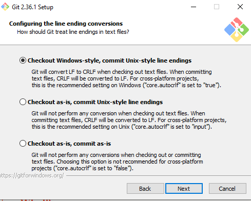

A terminál maradjon az alap `MinTT`-n

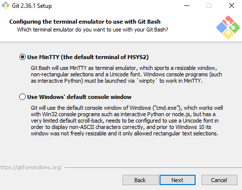

A `git pull` viselkedése is maradhat az alapon

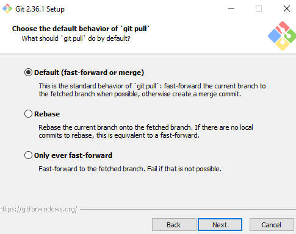

A credential manager maradjon bekapcsolva:

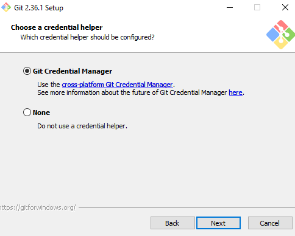

**Ajánlott** a symbolic linkek engedélyezése, illetve a cache is legyen bekapcsolva

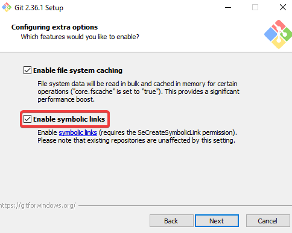

Az experimental feature beállításokat hagyjuk kikapcsolva

És ha eljutottunk idáig, akkor már csak a telepítés gombot kell megnyomni.

Ha elkészült a telepítés, vegyük ki a pipát a release notes mellől, és nyomjuk meg a Finish gombot.

🎉 Készen vagyunk! 🎉

## Felkészülés az első használatra

A gitet informálni kell, hogy milyen néven szeretnénk használni.
Nyissunk egy parancssort és futtasuk az alábbi parancsokat a GitHub-os adatainkkal.

```sh
git config --global user.name "Legolaszstudio"
git config --global user.email "legolaszstudio@novy.software"
```

> Az idézőjelek **közé** írjuk be a felhasználónevünket és GitHub-os email címünket.

### Készítsünk egy teszt repository-t a Github oldalán

Navigáljunk az aszoút kezdő oldalra, majd nyomjunk rá bal felül a new gombra.

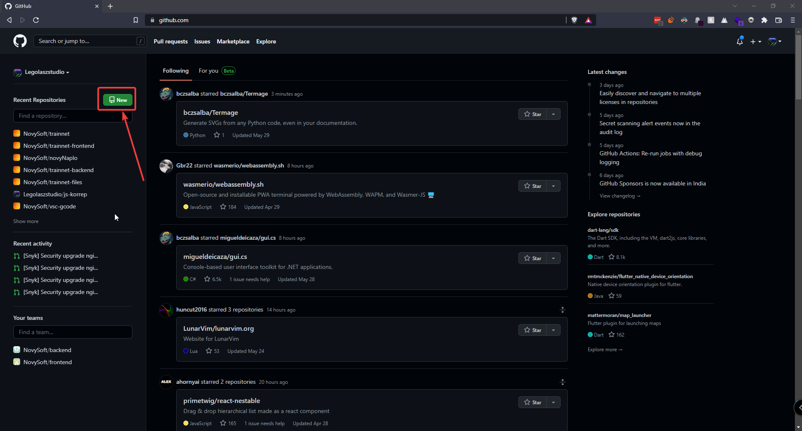

- Adjunk a reponak egy frappáns nevet, mondjuk `hello-world`
- Állítsuk a repot publikusra
- És pipáljuk be a `README`-t
- Majd kattintsunk a létrehozásra

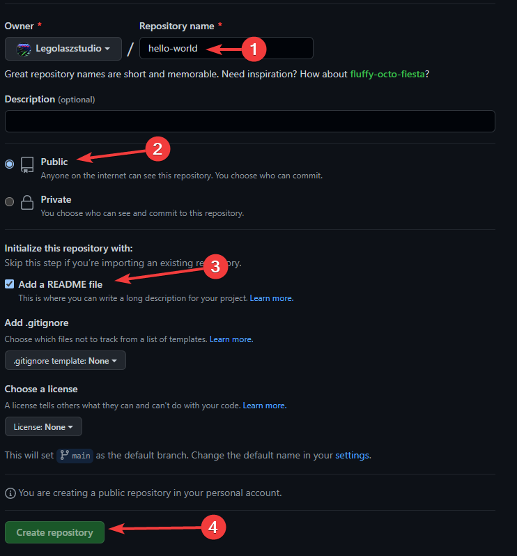

### Másoljuk a teszt repository-t a gépünkre

Nyissuk egy terminált, oda ahova a kódot szeretnénk másolni.
(Shift+Jobb klikk -> `Open Git Bash here` vagy `Open powershell here`)

> :warning: Ne csináljunk külön mappát, a git csinál majd nekünk

Másoljuk a `CODE` gombnál található linket egy `git clone` parancs után:

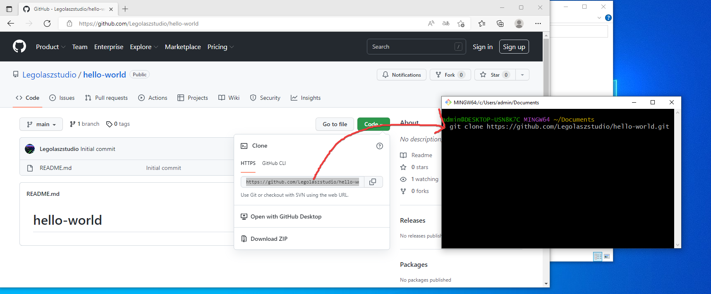

Nyissuk meg az új mappákant, amiben a `README.md`-t találjuk, vsc-ben.
Folytatás a [vsc](vsc.md)-s oldalon!