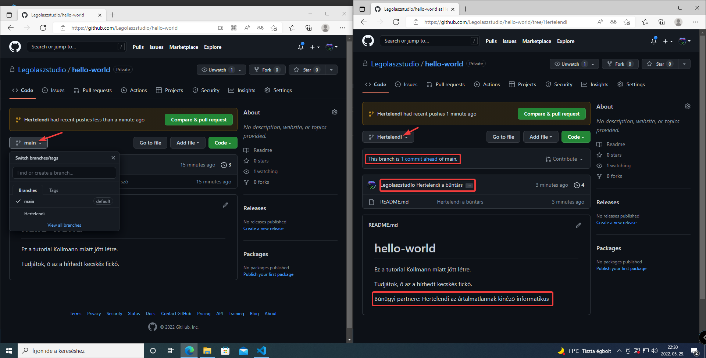

# Git használata vsc-n belül
(ez részben folytatása a telepítési útmutatónak)

## Áttekintés

Módosítsunk valamit a fájlainkban, pl.: Írjunk valamit a readme-be.
Ha jól csináltunk mindent, akkor a fájlunk sárgára vált, megjelink melette egy M-betű, így jelezve, hogy ez a fájl módosult az utolsó mentés (commit) óta.

A fájlon belül a sorok mellett is megjelenik, hogy melyik sor módosult, erre rá is lehet kattintani.

Továbbá az oldal menüben a kis branch jel melett is megjelenik a módosult fájlok száma.

## Commitolás

A verziókezelő menüben találhatjuk a módosított fájlok listáját, rájuk kattintva mutatja a vsc a változtatásainkat.
Illetve a fájl mellet található visszanyíl gombra kattintva vissza tudunk állni a fájl előző verziójára. (el vetjük a változtatásokat) (Ez **nem visszavonható**)

A lista feleti ablakban tudjuk megadni a változtatás nevét, majd a pipára nyomva commitolhatjuk azt.

> :ok_hand: Érdemes a commitjainknak leíró neveket alkalmazni, szükség esetén több sorba leírni változtatásainkat, hogy később könnyen vissza tudjuk keresni őket.

### Ha először commitolunk

Felugrik egy ablak ami megkérdezi, hogy szeretnénk-e automatikus stash-elést, ezt ajánlott mindig bekapcsolva hagyni.

Mivel a commit alapból mindig csak a mi gépünkön létezik, ezért fel kell szinkronizálni (pusholni) a távoli szerverre is. Ezt a bal alul található szinkronizációs gombbal csinálhatjuk, ami azt is mutatja, hogy hány változtatás van felfelé és lefelé.

A felugró ablakot érdemes kiütni, hogy ne mutassa többet ezt az üzenetet, mert mi nagyon tudjuk, hogy mit csinálunk.

Ezek után már csak a `sign in with your browser` gombot megnyomva be kell jelentkeznünk a github fiókunkba.

Ha meg vagyunk a vsc felajánlja az automatikus `fetch` futattást, ezt engedélyezzük neki.

Yeepee, commitunk már a GitHub oldalán is látható:

## Stash (stage)

A stash azokat a fájlokat tartalmazza amiket commitolni fogunk, ha nem adunk meg semmit a stash-be, akkor a vsc automatikusan stasheli az összes fájlt.

Mondjuk én csak a readme módosításait szeretném feltölteni GitHub-ra és a titkos mp4 fájlt nem, akkor csak azt adom hozzá a stash-hez, a mellete található plusz gombbal (a stashből meg a minusz gombbal tudunk eltávolítani):

Ha most commitolok, akkor az mp4 fájl nem kerül ki githubra, de a stash-elt módosítás igen.

## Branchek

Branchek között lépegetni a bal alul található branch név gombbal tudunk.
Illetve új branchet is itt tudunk létrehozni.

Ha már az új branchen commitolunk feltűnhet, hogy szinkronizációs nyíl egy felhőre cserélődött, ez azért van mert a branch még csak lokálisan létezik, ezért fel kell tenni a szerverre is. Nyugodtan megnyomhatjuk ugyanúgy viselkedik, mint a szinkronizáció.

A gitet megnézve látjuk, hogy módosításunk csak branchet váltva látszódik, mivel a kettő ág független egymástól.

## Merge

Szeretném, hogy hertelendi feliratja megjelenje a main branchen:
Először váltsunk arra a branchre, ami**be** szeretnénk mergelni.
A merge menü eléggé el van rejtve:

Aztán megkérdezi, hogy **mit** szeretnénk mergelni (jelen esetben a Hertelendi branch-et).

Ha minden jól megy, akkor megjelenik egy új commit, amit lehet szinkronizálni:

### Merge conflict

Merge conflict akkor alakul ki, ha két branchen módosítják ugyanazt a kódot, ilyenkor a vsc egy ablakban felajnálja a lehetőségeinket a konfliktus elhárítására.

Ha azt szeretném, hogy az npc-s felirat maradjon meg, akkor a `current change`-t fogadom el, ha a css master feliratot szeretném, akkor meg elfogadom az `incoming change`-t.

> :ok_hand: Jó tudni: Amennyiben egyik változtatás sem tetszik, akár saját változatra is átírhatom a kódot.