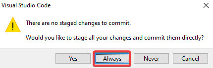

# Git használata vsc-n belül
(ez részben folytatása a telepítési útmutatónak)

## Áttekintés

Módosítsunk valamit a fájlainkban, pl.: Írjunk valamit a readme-be.
Ha jól csináltunk mindent, akkor a fájlunk sárgára vált, megjelink melette egy M-betű, így jelezve, hogy ez a fájl módosult az utolsó mentés (commit) óta.

A fájlon belül a sorok mellett is megjelenik, hogy melyik sor módosult, erre rá is lehet kattintani.

Továbbá az oldal menüben a kis branch jel melett is megjelenik a módosult fájlok száma.

## Commitolás

A verziókezelő menüben találhatjuk a módosított fájlok listáját, rájuk kattintva mutatja a vsc a változtatásainkat.
Illetve a fájl mellet található visszanyíl gombra kattintva vissza tudunk állni a fájl előző verziójára. (el vetjük a változtatásokat) (Ez **nem visszavonható**)

A lista feleti ablakban tudjuk megadni a változtatás nevét, majd a pipára nyomva commitolhatjuk azt.

> :ok_hand: Érdemes a commitjainknak leíró neveket alkalmazni, szükség esetén több sorba leírni változtatásainkat, hogy később könnyen vissza tudjuk keresni őket.

### Ha először commitolunk

Felugrik egy ablak ami megkérdezi, hogy szeretnénk-e automatikus stash-elést, ezt ajánlott mindig bekapcsolva hagyni.

Mivel a commit alapból mindig csak a mi gépünkön létezik, ezért fel kell szinkronizálni (pusholni) a távoli szerverre is. Ezt a bal alul található szinkronizációs gombbal csinálhatjuk, ami azt is mutatja, hogy hány változtatás van felfelé és lefelé.

A felugró ablakot érdemes kiütni, hogy ne mutassa többet ezt az üzenetet, mert mi nagyon tudjuk, hogy mit csinálunk.

Ezek után már csak a `sign in with your browser` gombot megnyomva be kell jelentkeznünk a github fiókunkba.

Ha meg vagyunk a vsc felajánlja az automatikus `fetch` futattást, ezt engedélyezzük neki.

Yeepee, commitunk már a GitHub oldalán is látható:

