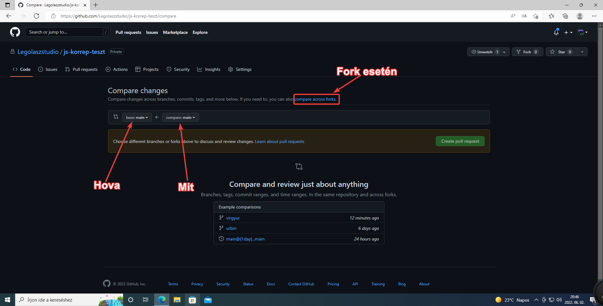

# A webes GitHub felület

> :ok_hand: Jó tudni: Ha lenyomjuk a `.  (pontot)`, akkor a github átírányít egy vsc szerű felületre, ahonnan könyebben menedzselhetünk nagyobb kódok szerkesztését is. (csak akkor működik, ha be vagyunk jelentkezve)

## Commit

Nyomjunk egy fájl szerkesztésére, és így kb ennyi, alul meg lesz egy nagy zöld commit gomb

## Branch

Branchet a branch menübe való gépeléssel kell létrehozni. Vagy már létezőt is választhatunk.

## Merge (pull request)

A pull request fülön, a nagy zöld: `Crate pull request` gombot nyomja, valami ilyet kapunk:

Ha sikeresen ki választunk 2 különböző branchet, akkor mutatja, hogy mik a különbségét, és egy mezőt, ahova beírhatjuk, hogy mit csináltunk:

Létrehozás után, a pull request-t a `Merge` gombbal lehet befésülni:

### Merge conflict

Merge conflict akkor alakul ki, ha két branchen módosítják ugyanazt a kódot, ilyenkor a git felajánlja, hogy mit szeretnénk tenni:

Itt neked kell a kódot átírnod, hogy csak az marajdon, amit szeretnél, majd jobb felül nyomd meg a resolve gombot, ha minden resolve sikeres, akkor átvált commitra, nyomjuk meg azt is:

Ha minden sikerült, akkor megjelenik a resolve commit, és már tudunk is mergelni.

## Emberek meghívása a projektünkhöz

Ha szeretnénk másoknak is engedni, hogy turkáljanak és módosítsanak kódunkban:
