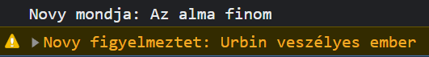

# Függvények/metódusok

A függvények névvel ellátott kódrészek, amire hivatkozni tudsz, ezért nem kell legépelni a kódot többször, elég csak a nevére hivatkozni.

> :ok_hand: Jó tudni: Azok a kód részek amik nem térnek vissza, azokat **nem** függvénynek, hanem **metódusnak** hívják.

Pl.: Egy function ami kiírja, hogy alma

```js
function alma() { // Elnevezzük ezt a kód rész almának (de nem fut le, csak elnevezzük)
  console.log("alma");
}

alma(); // A név mögötti zárójel jelzi, hogy ezt a kódot le kell futatni
```

## Viszatérés

A függvények tudnak értékeket visszadni, amiket később felhasználhatunk máshol a kódban:
Ehhez a `return` kulcsszót használjuk;

```js
function kerdes() {
  const valasz = prompt("Mit érzel?");
  return valasz;
}

function kettoMegKetto() {
  return 2 + 2;
}

const kerdesreValasz = kerdes();
console.log(kerdesreValasz);

const eredmeny = kettoMegKetto();
console.log(eredmeny); // 4
```

## Paraméterek

A paraméterek segítségével változókat adhatunk a függvényeken belülre kívülről.
Ez azért jó, mert a változók [scope](../Elso/valtozo.md#scopeok)-oltak.

Gondoljunk úgy egy függvényre, mint matekban az `f(x)`-re, van egy x érték, amihez hozzárendelünk egy "y" értéket.

```js
function sin(x) { // Elnevezzük x-nek azt a számot amit a függvény híváskor beírunk, x csak a function határain belül létezik
  return Math.sin(x); // Visszaadjuk x-nek a sin-jét
}

alert(`2 sin-je ${sin(2)}`); // <-- A számot akár közvetlenül is megadhatjuk

const szam = parseFloat(prompt("Mondj egy számot:"));
const sinSzam = sin(szam); // <--- a bemenet névnek nem kell egyezni a paraméter névvel
alert(`${szam} sin-je ${sinSzam}`);
```

## Menő nyilas szintaxis

Ugyanazt tudja mint a sima function, csak más a szintaxisa.

```js
const alma = () => {
  console.log("alma");
};

const sin = (x) => {
  return Math.sin(x);
};

// Ha elhagyjuk a kapcsos zárójelet, akkor return sem szükséges
const osszeadas = (a, b) => a + b;
/* Ugyanaz, mint a
function osszeadas(a, b) {
    return a + b;
}
*/

console.log(osszeadas(3,5)); // 8
```

## Objetumos függvények

Ha kicsit összerakjuk az eddig tanultakat, akkor lehet, hogy feltünt, hogy a console parancsokat `console.` prefixxel érjük el, ez azért van, mert a console egy objektum.

Csináljunk egy saját console-t:

```js
const novyConsole = {
    log: function (inp) { // Nem kell név a kód résznek mivel már baloldalt megadtuk
        console.log(`Novy mondja: ${inp}`);
    },
    warn: (be) => { // Menő nyilas syntaxxal
        console.warn(`Novy figyelmeztet: ${be}`);
    }
};

novyConsole.log('Az alma finom');
novyConsole.warn('Urbin veszélyes ember');
```
