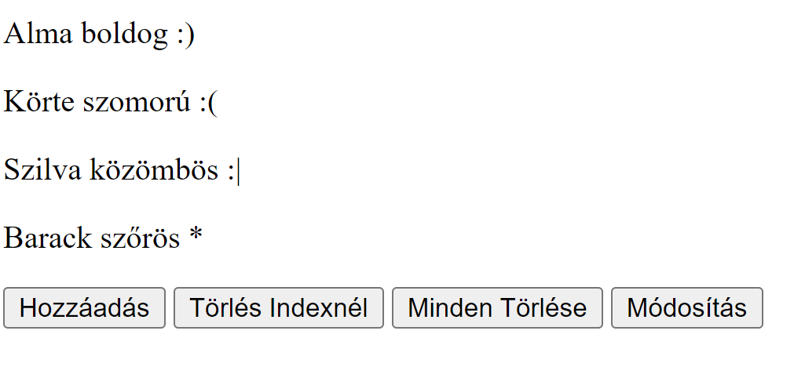
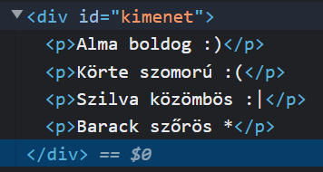

# Hangulat lista

Készíts egy programot, amiben nyomon tudod követni emberek hangulatát (boldog, szomorú, közömbös). _(1 pont)_
Az emberek nevét és hangulatát 1 objektumban csoportosítva listában tárold.

Készíts html interfészt a kódod-nak;

- csinálj gombot ember felvételéhez _(1 pont)_
- egy gombot ami megkérdezi, hogy hányadik embert szeretnéd törölni, és kitörli azt, _(2 pont)_
- egy gombot, amivel mindenkit ki lehet törölni (a két törlés gombot próbáld 1 függvénnyel megoldani), _(3 pont)_
- egy gombot, amivel egy bizonyos nevű ember hangulatát meg lehet változtatni. _(3 pont)_

Az adatokat automatikusan, minden módosítás után jelenítsd meg egy `<p>` tag-ben és egy switch segítségével rakj hangulatnak megfelelő smiley-t a sor végére (ha ismeretlen hangulatot ad meg a felhasználó, akkor egy `*`-ot rakjon) _(4 pont)_

Pl.:


<details>
<summary>Egy lehetséges megoldás</summary>

Html:

```html
<body>
    <p id="kimenet"></p>
    <input type="button" value="Hozzáadás" onclick="emberFelvetele()">
    <input type="button" value="Törlés Indexnél" onclick="emberTorlese('index')">
    <input type="button" value="Minden Törlése" onclick="emberTorlese('mind')">
    <input type="button" value="Módosítás" onclick="modosit()">
</body>
```

Js: 

```js
let emberek = [];

function emberFelvetele() {
    emberek.push({
        nev: prompt("Kérem a nevét"),
        hangulat: prompt("Kérem a hangulatát"),
    });
    kiir();
}

function emberTorlese(kit) {
    if (kit == 'mind') {
        emberek = [];
    } else {
        const index = parseInt(prompt(`Hanyadikat távolítsam el? (0-tól ${emberek.length - 1}-ig)`));
        emberek.splice(index, 1);
    }
    kiir();
}

function modosit() {
    const nev = prompt("Kit módosítsak?");
    for (const element of emberek) {
        if (element.nev == nev) {
            const ujhangulat = prompt("Kérem a hangulatát");
            element.hangulat = ujhangulat;
            break;
        }
    }
    kiir();
    /* 
    Vagy for i looppal
    for (let index = 0; index < emberek.length; index++) {
        if (emberek[index].nev == nev) {
            const ujhangulat = prompt("Kérem a hangulatát");
            emberek[index].hangulat = ujhangulat;
            break;
        }
    }
    */
}

function kiir() {
    let kimenet = "";
    for (const element of emberek) {
        kimenet += `${element.nev} ${element.hangulat} `;
        switch (element.hangulat) {
            case "boldog":
                kimenet += ":)";
                break;
            case "szomorú":
                kimenet += ":(";
                break;
            case "közömbös":
                kimenet += ":|";
                break;
            default:
                kimenet += "*";
                break;
        }
        kimenet += "<br>";
    }
    document.getElementById("kimenet").innerHTML = kimenet;
}
```

</details>
<br>


## Szorgalmi

**Utánanézős szorgalmi feladat**: .appendChild() és document.createElement() segítségével old meg, hogy egy div-en belül külön p-kbe vannak a kimenetek. _(**+2** pont)_

Pl.:


<details>
<summary>Egy lehetséges megoldás</summary>

Html-ben a kimetet átírjuk div-re:
```html
<body>
    <div id="kimenet"></div>
    ...
</body>
```

És egy kicsit átalakítjuk a kiir függvényt:
```js
function kiir() {
    document.getElementById("kimenet").innerHTML = ''; // üresre állítja a kimenetet
    for (const element of emberek) {
        let kimenet = "";
        kimenet += `${element.nev} ${element.hangulat} `;
        switch (element.hangulat) {
            case "boldog":
                kimenet += ":)";
                break;
            case "szomorú":
                kimenet += ":(";
                break;
            case "közömbös":
                kimenet += ":|";
                break;
            default:
                kimenet += "*";
                break;
        }
        const pElement = document.createElement("p"); // Virtuális p létrehozása
        pElement.innerText = kimenet;
        document.getElementById("kimenet").appendChild(pElement); // Hozzáadjuk az új p-t a kimenethez
    }
}
```

</details>