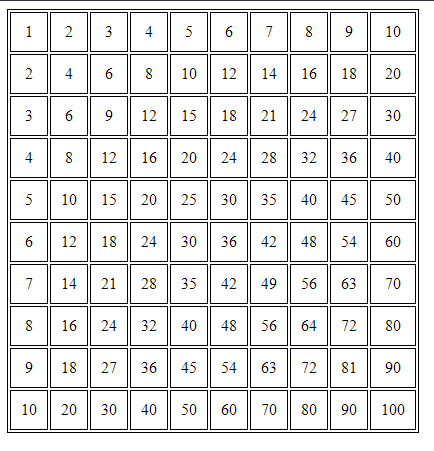

# Szorzótábla html + js

Na szóval `<script>` tag, gondolom ismerős, nem?

Mit kellene tudni? [For loop](../Elso/ciklus.md#for-i) és valamilyen htmlbe író cuccot mondjuk a [document.write()](#documentwrite) függvényt.

## document.write

A [document.write](https://developer.mozilla.org/en-US/docs/Web/API/Document/write) függvény, a dokumentumba az a legfelső html kódba fog nekünk írni, igazából felfoghatjuk úgy, mint a [console.log](../Elso/alert_log_prompt.md#log)-ot, csak ez nem a konzolba ír, hanem a html kódba közvetlenül.

> ❗⚠️ **!!FIGYELEM!!** ⚠️❗ A document.write függvény elavult, ne használjuk, mert esetenként teljesen váratlanul működhet, és biztonsági rés is, mivel "fertőtlenítés" nélkül közveltenül kódot írhatunk bele a böngészőbe.

<!-- FIXME: Nincs get element by doksi -->
> ✅ Használjuk inkább a document.getElementBy ([id](https://developer.mozilla.org/en-US/docs/Web/API/Document/getElementById), [class](https://developer.mozilla.org/en-US/docs/Web/API/Document/getElementsByClassName), [queryselector](https://developer.mozilla.org/en-US/docs/Web/API/Document/querySelector), stb) függvényeknek az [innerTEXT](https://developer.mozilla.org/en-US/docs/Web/API/HTMLElement/innerText), ha nagyon muszáj [innerHTML](https://developer.mozilla.org/en-US/docs/Web/API/Element/innerHTML), tulajdonságát.


## Megoldás

#### Hogyan csinálok szorzótáblát?

Mondjuk 10*10 is táblát szeretnék, ilyet hogy tudok programként csinálni?
Gondoljuk végig, emberként hogy csinálnád?

Végig írod előszőr az 1-es szorzótáblát;
```
1*1=1
1*2=2
...
1*10=10
```

Aztán a 2-es szorzótáblát;
```
2*1=2
2*2=4
...
2*10=20
```

És így tovább, amíg el nem éred a 10-est.

Amint észrevehetjük az összefüggést minden szorzótábla esetén csak az első szám változik, a második mindig 1-től 10-ig megy.
Ezt programkódban is nagyon egyszerűen meg lehet oldani;

#### For loopok?

```js
// A szám a bal oldalon (i)
for (let i = 1; i <= 10; i++) {
    // A szám a jobb oldalon (j)
    for (let j = 1; j <= 10; j++) {
        // Írjuk ki szépen őket;
        console.log(`${i} * ${j} = ${i*j}`);
    }
}
```

> A backtick (`) karakter azt jelzi, hogy ez egy [template literal](../Elso/alert_log_prompt.md#template-literal)

Természetesen ez a kód csak a console-ba írja ki, szóval oldajuk meg, hogy egy html táblázatba írja ki.


#### Htmlbe írás

Sajnos a document.write nem tud beleírni a html közepébe (mindig a végére ír) ezért kénytelenek vagyunk a [táblázat alapját](https://www.tablesgenerator.com/html_tables) is document.write-al elkészíteni;

```js
document.write('<table>')
for (let i = 1; i <= 10; i++) {
    document.write('<tr>')
    for (let j = 1; j <= 10; j++) {
        document.write(`<td>${i * j}</td>`)
    }
    document.write('</tr>')
}
document.write('</table>')
```

Ha kíváncsiak vagyunk mit csinál a kódunk, akkor a `document.write`-ot kicserélhetjük `console.log`-ra, valami ilyet kéne látni. (Utólag formáztam)

```
<table>
<tr>
    <td>1</td>
    <td>2</td>
    ...
</tr>
<tr>
    <td>2</td>
    <td>4</td>
    ...
</tr>
<tr>
    <td>3</td>
    <td>6</td>
    ...
</tr>
...
</table>
```

És kész is vagyunk! már csak egy kis css és még szép is lesz;
